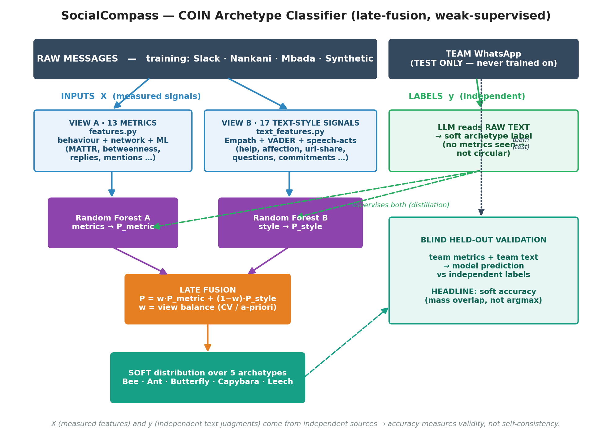

# SocialCompass — Team Communication Analyzer

**SocialCompass** classifies each member of a group chat into one of five
**communication archetypes** (after Gloor, *Happimetrics*, 2022) by reading the
conversation the way a person would — combining *how the network behaves* with
*how people write*.

| | Archetype | Communication role |
|---|---|---|
| 🐝 | **Bee** | Central connector / initiator — drives and cross-pollinates discussion |
| 🐜 | **Ant** | Reliable task worker — steady, substantive delivery |
| 🦋 | **Butterfly** | Information bridge — shares links, news and summaries that connect topics |
| 🦫 | **Capybara** | Warm supporter — gratitude, encouragement, harmony |
| 🔴 | **Leech** | Low-reciprocity participant — receives more than contributes |

The model is trained on large public developer/community chats and validated as
a **blind external test** on a separate small team chat it never saw in training.

---

## Why it is methodologically sound

Three deliberate design choices, each fixing a failure mode of the naïve
approach:

1. **No circular labeling.** The behavioural metrics are the model *input* (X);
   the archetype labels (y) are produced *independently* by a **large language
   model reading the raw messages**. Because X and y come from two different
   sources, "accuracy" measures validity, not self-consistency.
   *(Weak supervision — Ratner et al. 2020; soft-label distillation — Hinton et
   al. 2015.)*

2. **Strict train/test separation.** Training uses public chats only. The
   evaluation team chat is **test-only** — never labeled from metrics, never
   trained on. A blind gold standard (an LLM reading the team's text without
   seeing any metric) is the only honest test.

3. **Late fusion of two independent views.** Network metrics are
   scale-dependent and unreliable on a tiny group; text style is
   scale-invariant. The model fuses them:
   `P = w · P_metric + (1 − w) · P_style`, with **w chosen by cross-validation**,
   so the blend is data-driven, not hand-tuned.



---

## The two views

Two Random-Forest **soft regressors** distil the same soft labels:

- **Metric view — 13 behaviour / network signals**
  `avg_msg_length`, `question_ratio`, `task_focus_score`, `harmony_score`,
  `emoji_ratio`, `emotion_density`, `initiation_rate`, `MATTR`,
  `in_out_ratio`, `replies_sent`, `avg_mentions`, `betweenness_centrality`,
  `response_consistency`. Mentions and the reply graph are parsed from real
  message structure (Slack / WhatsApp / generic).

- **Text-style view — 17 *citable* language signals**
  Empath categories (help, affection, work, leader, giving, …; Fast et al.
  2016, *r* = 0.906 with LIWC), VADER sentiment (Hutto & Gilbert 2014), and
  speech-act signals (question / commitment rate; Searle 1976), plus structural
  pragmatics (link-share, mention, emoji, length).

Each member receives a **probability distribution across all five archetypes**,
not a single hard label — so mixed, in-between profiles are expressed naturally.
The headline metric is **soft accuracy** (`Σ min(model, gold)`, the probability
mass the prediction shares with the label), which credits partial agreement on
fuzzy, overlapping targets instead of scoring a near-tie as a total miss.

---

## Results

- **Blind held-out team:** soft accuracy ≈ **75%**, cosine ≈ **0.89**, KL ≈ 0.15.
- **Out-of-fold per-class F1** (300 labeled users): the disclosed in-domain
  **synthetic augmentation** lifts macro-F1 **0.27 → 0.56** and makes the two
  starved classes (Butterfly, Capybara) learnable.
- **Fusion weight** is CV-selected; the CV curve is a flat plateau, confirming
  the scale-invariant text view carries most of the signal on small groups.

Honest limitations (documented, not hidden): Capybara/Butterfly are rare and
hard; `betweenness_centrality` is mathematically degenerate on a small
fully-connected group; small-team predictions carry real domain shift.

---

## Repository structure

```
.
├── README.md
├── requirements.txt
├── docs/
│   └── architecture.png
└── src/                         ← flat package; run as `python src/<x>.py` from repo root
    ├── config.py                ← single source of truth for every data/output path
    ├── parse_whatsapp.py        ← raw export → clean JSONL  (parse_nankani / parse_slack)
    ├── features.py              ← 13 behaviour/network metrics
    ├── features_v2.py           ← corrected interaction metrics (real mentions + reply graph)
    ├── ml_features.py           ← transformer / VADER emotion & harmony detectors
    ├── text_features.py         ← 17 grounded text-style signals (Empath / VADER / speech-acts)
    ├── build_v2_features.py     ← assembles the v2 feature matrices
    ├── make_synthetic.py        ← disclosed in-domain synthetic augmentation chats
    ├── label_synthetic.py       ← folds the synthetic labels into the label set
    ├── build_synthetic_features.py
    ├── train_ml.py              ← PRODUCTION: late-fusion model + CV weight selection
    ├── compare_holdout.py       ← blind held-out validation
    └── dashboard.py             ← Streamlit dashboard (friendly, 4 tabs)
```

All paths live in `src/config.py`, resolved relative to the repo root, so
scripts run from any working directory.

> **Data is not included.** Chat logs are private and never committed (see
> `.gitignore`). Bring your own exports into `data/raw/` and the pipeline below
> reproduces every artifact. Labels (y) are soft archetype distributions
> produced by a large language model reading raw text (weak supervision).

---

## How to run

```bash
pip install -r requirements.txt

# 1. parse raw exports → data/clean/
python src/parse_whatsapp.py
python src/parse_nankani.py
python src/parse_slack.py

# 2. (optional) generate the disclosed synthetic augmentation
python src/make_synthetic.py
python src/label_synthetic.py
python src/build_synthetic_features.py

# 3. build the corrected v2 feature matrices
python src/build_v2_features.py

# 4. train the production model (CV-selects the fusion weight)
python src/train_ml.py                 # with synthetic augmentation (default)
python src/train_ml.py --no-synthetic  # ablation arm

# 5. blind held-out validation
python src/compare_holdout.py

# 6. explore in the dashboard
streamlit run src/dashboard.py
```

---

## Scientific references

Gloor (2022) *Happimetrics* · Ratner et al. (2020) *Snorkel: weak supervision* ·
Hinton, Vinyals & Dean (2015) *Knowledge Distillation* · Breiman (2001) *Random
Forests* · Covington & McFall (2010) *MATTR* · Freeman (1977) / Brandes (2001)
*Betweenness centrality* · Goh & Barabási (2008) *Burstiness* · Kullback &
Leibler (1951) *KL divergence* · Fast, Chen & Bernstein (2016) *Empath* · Hutto &
Gilbert (2014) *VADER* · Mohammad & Turney (2013) *NRC EmoLex* · Tausczik &
Pennebaker (2010) *LIWC* · Danescu-Niculescu-Mizil et al. (2013) *Politeness* ·
Searle (1976) *Speech acts*.

## License

[MIT](LICENSE)
